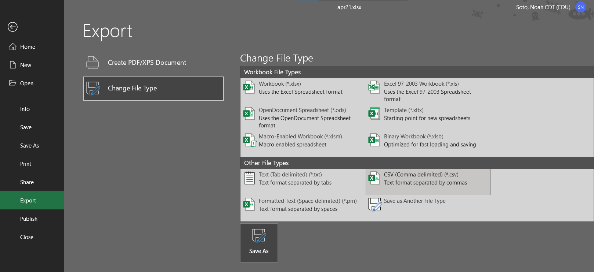
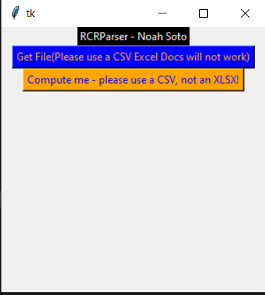

# rcrParser 
## Noah Soto

If we dont learn to automate the small tasks, we're only creating more work for ourseleves.

This project quickly parses through restricted cadet information and outputs readable information seperated by company so that the Restrcited Cadet Report is no longer the tedious and dreadful task that it once was.

This project also provides <b> At a Glance </b> information so that it is easier to keep track of analytical trends regarding Cadet Conduct through out the course of this semester.  This data can help inform C-DIV and Cadet Leadership on areas to improve, as well as provides a baseline as to whether or not conduct is increasing or decreasing over time.

## How do I use this?

### Get the CSV

This program requires that you first convert the Restricted Cadet Report, give to you as a `.xlsx` into a `.csv`.  Dont worry, this is pretty easy

Then click on `Save As` and choose a location you'll remember, you're going to need it.

### Running the file

Click on the `Get File` button.  This will bring up a file prompt, select the CSV you just created.

Then click on compute!

A text file will be generated in the same directory that you ran the `.exe` from.  

You may be prompted by Windows asking how you want to open the file, something like notepad, word, or even your web browser will suffice 
